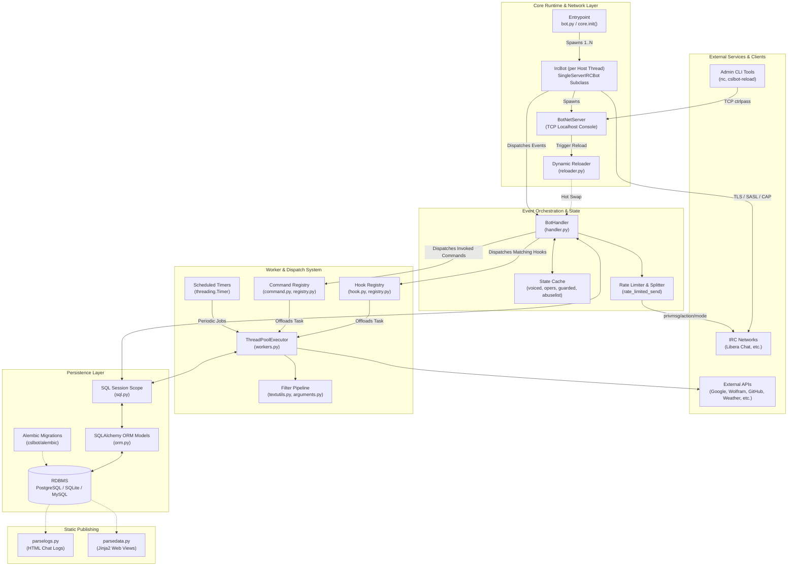
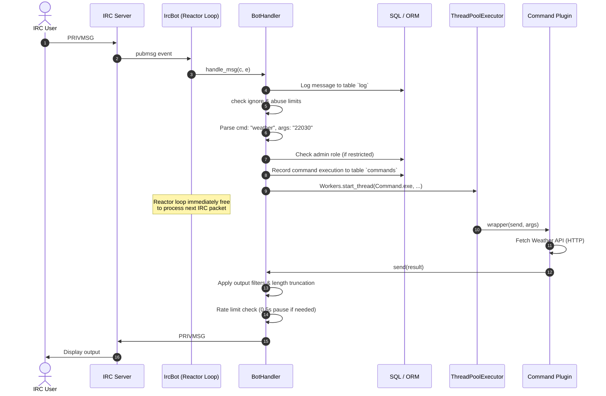
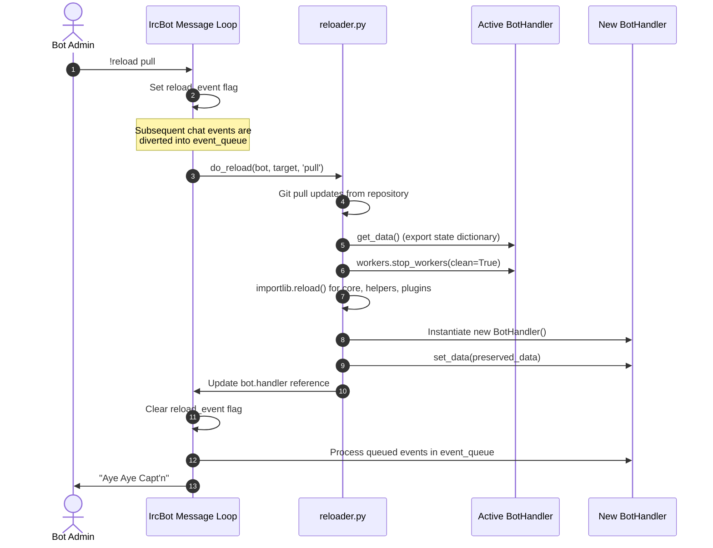

# CslBot Architectural Analysis

## 1. Executive Summary

**CslBot** is a modular, event-driven, multi-server Internet Relay Chat (IRC) bot originally authored by the Thomas Jefferson High School for Science and Technology (TJHSST) Computer Systems Lab (CSL). It is designed to handle high-frequency chat traffic across multiple IRC channels and servers simultaneously, providing extensive chat automation, content management (quotes, voting/polls, karma/scoring, memo notes, Markov-chain text synthesis), administrative moderation, and third-party API integrations.

The architecture emphasizes:
- **Decoupled execution**: A hybrid model separating synchronous event dispatch from asynchronous task execution via thread pools.
- **High availability & zero-downtime updates**: In-flight code and configuration reloading without terminating the IRC connection or losing transient channel state.
- **Extensible plugin ecosystem**: Declarative `@Command` and `@Hook` registries with dynamic discovery, group activation, and external module packaging.
- **Multi-tiered administration**: Dual-plane management via an authenticated out-of-band TCP daemon and in-band IRC control channels.

---

## 2. High-Level System Architecture

---

## 3. Subsystem Breakdown

### 3.1 Network & Connection Layer
- **Source Files**: [`core.py`](cslbot/helpers/core.py), [`server.py`](cslbot/helpers/server.py), [`bot.py`](bot.py)
- **Engine**: Inherits from `irc.bot.SingleServerIRCBot` and `irc.client.Reactor`.
- **Multi-Server Concurrency**: `core.init` parses comma-separated host targets in `config.cfg`, spawning an autonomous `IrcBot` instance per network inside its own dedicated OS thread (`threading.Thread`).
- **IRCv3 Negotiation**: Custom reactor instantiation hooks into `do_cap` during TLS handshake to request modern IRCv3 features:
  - `account-notify` (tracking NickServ account authentication states in real-time)
  - `extended-join` (obtaining account metadata upon channel join)
  - `sasl` (plain text authentication via base64 encoded token strings before registering nick)
  - `WHOX` (extended who query syntax `%naft` for bulk nick/account/mode discovery)
- **Flood Protection & Egress Buffering**: `rate_limited_send` enforces minimum 500ms pacing between socket transmissions protected by `flood_lock`. Messages exceeding the IRC 512-byte payload ceiling are automatically chunked with word-boundary splitting in `build_split_msg`.

### 3.2 Event Dispatch & Moderation Engine
- **Source File**: [`handler.py`](cslbot/helpers/handler.py)
- **Primary Orchestrator**: `BotHandler` acts as the central hub receiving events from the IRC reactor.
- **Dual-Channel Operating Topology**:
  1. *Public Chat Channels*: User commands, chat logging, heuristic hooks.
  2. *Control Channel (`ctrlchan`)*: Out-of-band operations hub. All stack traces, security alerts, pending item moderation queues (quotes, polls, issues, tumblr links), and configuration changes are routed here to keep public channels noise-free.
- **State Tracking**:
  - `voiced` and `opers`: Tracks channel modes (`+v`, `+o`) per nickname per channel via `mode`, `join`, `part`, `quit`, `nick`, and `whospcrpl` handlers.
  - `guarded`: Monitors protected users; if an unauthorized user devoices or quiets a guarded user, the bot automatically counters with `+voe-qb`.
  - `abuselist`: Implements a sliding-window rate-limiter per user per command, auto-ignoring aggressive users upon threshold breach.

### 3.3 Concurrency & Asynchronous Task Model
- **Source Files**: [`workers.py`](cslbot/helpers/workers.py), [`command.py`](cslbot/helpers/command.py), [`hook.py`](cslbot/helpers/hook.py)
- **Architecture**:
  - The IRC network loop (`reactor.process_once`) remains strictly non-blocking.
  - Commands and hooks are decorated with `@Command` and `@Hook`.
  - When invoked, execution is dispatched to a global `concurrent.futures.ThreadPoolExecutor` via `Workers.start_thread`.
  - Long-running API calls (e.g. Wolfram Alpha, weather lookups, URL scraping) execute in worker threads without delaying IRC message processing or ping/pong heartbeats.
- **Background Cron Timers**:
  - Managed via `threading.Timer` wrappers (`Workers.defer`):
    - `handle_pending` (hourly reminder of unreviewed quotes/polls to the control channel)
    - `update_babble` (hourly Markov model database synchronization)
    - `check_active` (hourly cleanup stripping voice `+v` from lurkers inactive > 24 hours)
    - `send_quotes` (daily quote of the day broadcast)

### 3.4 Plugin & Registry Architecture
- **Source Files**: [`registry.py`](cslbot/helpers/registry.py), [`modutils.py`](cslbot/helpers/modutils.py)
- **Dynamic Discovery & Grouping**:
  - Plugins reside in `cslbot/commands/` (119 command modules) and `cslbot/hooks/` (18 hook modules).
  - Categorized in [`groups.cfg`](groups.cfg) into logical bundles: `admin`, `core`, `useful`, `optional`, `disabled`.
  - Modules can be toggled on/off at runtime via control channel commands without rebooting the bot.
- **Auxiliary Packages**:
  - Supports external plug-in packages via `extramodules` (e.g., `cslbot-tjhsst`). `modutils.get_modules` discovers and imports external modules alongside core modules.
- **Context Injection**:
  - Commands declare needed dependencies in their decorator args (e.g. `['db', 'nick', 'target', 'config', 'do_kick']`).
  - `BotHandler.do_args` automatically injects the requested services into the execution context.

### 3.5 Hot-Reloading & Resilient Lifecycle Management
- **Source Files**: [`reloader.py`](cslbot/helpers/reloader.py), [`core.py`](cslbot/helpers/core.py)
- **Zero-Downtime Hot Reload Mechanism**:
  1. Triggered via `!reload` (in IRC) or through the TCP socket console (`server.py` / `reload.py`).
  2. The bot enters a transitional state: `self.reload_event.set()`.
  3. Incoming IRC messages are buffered in `self.event_queue` rather than dropped.
  4. Optionally pulls latest code directly from Git (`reloader.do_reload(..., cmdargs='pull')`).
  5. The runtime state dictionary (`guarded`, `voiced`, `opers`, `uptime`, `abuselist`, `who_map`) is serialized into memory via `handler.get_data()`.
  6. Existing worker threads and timers are cleanly wound down (`handler.workers.stop_workers(clean=True)`).
  7. Module definitions are reimported using `importlib.reload()` across `config`, `helpers`, `commands`, and `hooks`.
  8. A fresh `BotHandler` is instantiated, restored with preserved state data via `handler.set_data(data)`, and connected to the existing IRC connection.
  9. Buffered queue events are flushed and executed.

### 3.6 Persistence & Data Models
- **Source Files**: [`sql.py`](cslbot/helpers/sql.py), [`orm.py`](cslbot/helpers/orm.py), [`cslbot/alembic/`](cslbot/alembic)
- **Database Engine**: SQLAlchemy with generic connection string support (PostgreSQL in production, SQLite in test/development, MariaDB/MySQL compatible).
- **Session Scoping**: `Sql.session_scope` implements a transactional context manager guaranteeing atomic commits and automatic rollbacks on unhandled errors.
- **Database Migrations**: Version-controlled with Alembic (`cslbot-migrate` / `alembic upgrade head`).
- **Core Entities**:
  - `Log`: Comprehensive audit trail of all messages, channel events, modes, and timestamps.
  - `Quotes`, `Polls`, `Poll_responses`: Community interaction and archival with approval flag workflows (`accepted = 0/1`).
  - `Scores`: Persistent karma tracking (`nick` -> integer `score`).
  - `Babble`, `Babble2`, `Babble_count`: Bi-gram and n-gram Markov-chain state storage for procedural sentence generation.
  - `Permissions`: Role-based privileges (`owner`, `admin`) correlated with NickServ verification timestamps.

### 3.7 Text Transformation & Filter Pipeline
- **Source Files**: [`textutils.py`](cslbot/helpers/textutils.py), [`arguments.py`](cslbot/helpers/arguments.py)
- **Command Argument Parser**: Custom `ArgParser` subclassing Python's standard `argparse.ArgumentParser` to avoid `sys.exit()` upon syntax errors, raising `ArgumentException` instead.
- **Pipeable Filters**:
  - Commands accept a standard `--filter <filter_list>` parameter.
  - Over 25 composable transformations exist in `output_filters` (e.g. `rot13`, `reverse`, `morse`, `fullwidth`, `translate`, `gizoogle`, `shakespeare`).
  - Output functions wrap `send()` recursively, piping string results through each transformation before transmission.

---

## 4. Key Workflows & Sequence Diagrams

### 4.1 Message Handling & Command Execution Flow

### 4.2 Dynamic Zero-Downtime Hot Reload Flow

---

## 5. Architectural Strengths

1. **Reactor / Worker Decoupling**: Offloading command logic to a `ThreadPoolExecutor` ensures that slow external network I/O or database queries never trigger IRC ping timeouts or disconnects.
2. **State-Preserving In-Memory Reloader**: The ability to pull code, re-compile/import modules, and reinitialize handler classes without dropping socket connections allows uninterrupted production uptime.
3. **Resilient Error Isolation**: Uncaught exceptions inside plugins are intercepted by `backtrace.py`, translated into actionable traces in `#ctrlchan`, and masked into courteous notices in public channels, preventing full daemon crashes.
4. **Declarative Modular Extensibility**: Writing new features requires only dropping a script with `@Command` into `cslbot/commands/`. Dynamic dependency injection eliminates repetitive boilerplate.
5. **Separation of Management Planes**: Isolating administrative controls to an encrypted/passworded local TCP socket and private IRC control channel protects public chat integrity.

---

## 6. Architectural Opportunities & Modernization Considerations

1. **Asyncio Migration**: The architecture uses synchronous blocking libraries (`requests`, `irc`, `socketserver`) wrapped inside thread pools. Modernizing the I/O layer with Python's native `asyncio` (`aiohttp`, `asyncpg`, `irc.client.AioReactor`) would significantly reduce memory footprint and thread synchronization complexity (`data_lock`, `worker_lock`, `flood_lock`).
2. **Global Mutable State in Reloader**: `registry.command_registry` and `modutils.registry` use module-level singletons. Reloading relies on clearing and re-populating mutable global dictionaries, which can occasionally risk race conditions if commands are in-flight during a reload.
3. **API Key & Secret Management**: The configuration file `config.cfg` stores plaintext API keys, database credentials, and IRC passwords. Integrating environment variable expansion or secret management (e.g. HashiCorp Vault, systemd-creds) would improve deployment security.
4. **SQLAlchemy 2.0 Typing & Style**: While updated in `pyproject.toml` to SQLAlchemy 2.0, several ORM queries still use legacy 1.x session query patterns (`session.query(Model).filter(...)`) rather than modern 2.0 `select()` executables.
